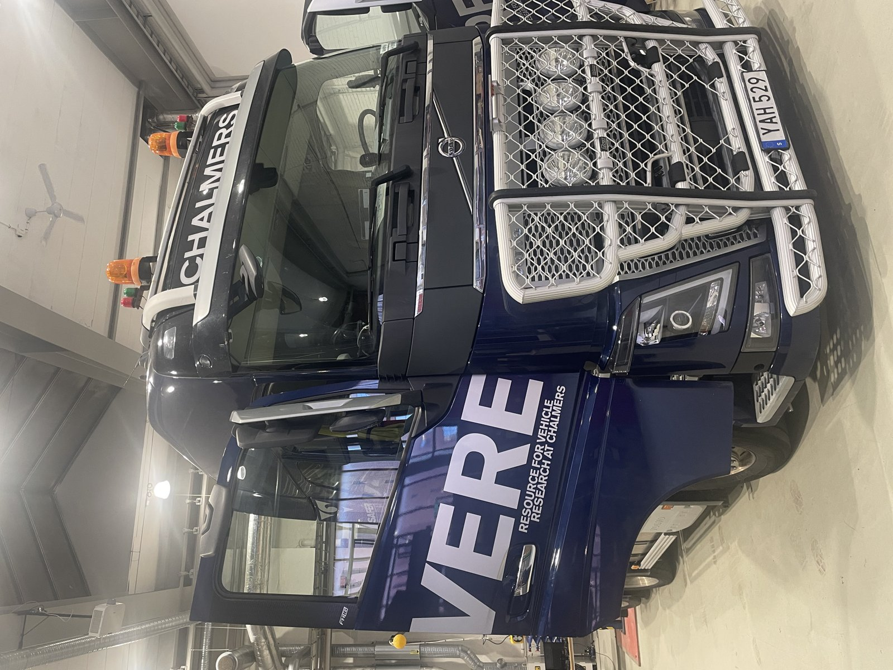
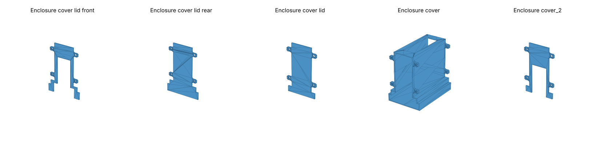

# Connected Fleets in Data-Driven Engineering – Truck Driver Ride Comfort

**Course:** MMS210 Connected Fleets in Data-Driven Engineering, Chalmers University of Technology (May 2025)
**Group 2 (Truck):** Kiran Kumar Palle, Karthik Hudugur Sathyanarayana, **Ramkumar Huleppa Munavalli**, Vinod Chaudhari, Prakash Raju Sridharraju, Punit Chandrappa
**Tools:** IMU data logger, MATLAB / Simulink, Siemens NX, OpenSCAD, 3D printing

📄 [Project report (PDF)](MMS210_Connected_Fleets_Report.pdf)



---

## Overview
This project studies the **whole-body vibration a truck driver feels on real roads**. It also shows how a **low-cost, seat-mounted data logger** could be scaled across a connected fleet to give OEMs real-world comfort data.

We rode along in a **Volvo FH16 780 HP** (air suspension on both chassis and seat) for about **30 km around Gothenburg**, on smooth, mixed and rough roads. An **IMU logger** in a custom **3D-printed enclosure** at the driver's seat recorded acceleration, yaw and GPS. The measurements were compared with a **3-DOF seat–cab–chassis model** in MATLAB/Simulink and assessed against **ISO 2631**. ISO 2631 treats the **4–8 Hz** band as the one the human body is most sensitive to.

## Workflow
1. **Hardware:** designed a sensor enclosure in Siemens NX, starting from the course's OpenSCAD reference, and 3D-printed it. Mounted it at the driver's seat armrest.
2. **Data collection:** a 47-minute, ~30 km drive logging seat acceleration, yaw angle and GPS position.
3. **Signal processing:** noise filtering with a **Savitzky–Golay (sgolay)** filter, then splitting the route into **smooth, mixed and rough** sections, with RMS computed for each.
4. **Road classification:** generated road profiles and compared their PSD with **ISO 8608** road classes:
   - Smooth ≈ Class B
   - Mixed ≈ Class B–D
   - Rough ≈ Class E
5. **Modelling:** a **3-DOF quarter-car model with seat** (seat, sprung and unsprung mass) in Simulink, driven by the ISO road profiles. The output is vibration at the driver's seat.
6. **Validation and comfort assessment:** compared measured and simulated RMS values and **FFT spectra** against the ISO 2631 8-hour comfort limit (0.33 g).
7. **Benchmarking and scalability:** compared the Volvo FH16 with the Scania R 730 and Kenworth T680, and assessed how the logger concept scales to a whole fleet.

## Results
| Road type | Measured RMS | Avg speed (m/s) | Model RMS | Model vs measured |
|-----------|------------------|-----------------|---------------|-------------------|
| Smooth (highway) | 0.266 | 21.5 | 0.226 | ~4 % under |
| Mixed | 0.346 | 13.2 | 0.377 | ~3 % under |
| Rough | 0.414 | 16.1 | 0.772 | ~35 % over |

- In the critical **4–8 Hz band**, the measured seat vibration stayed **below the ISO 2631 8-hour comfort limit (0.33 g)**. Peaks above the limit appeared only at higher frequencies.
- The model matches **smooth and mixed roads well**, but **overestimates rough-road vibration**. This points to simplified suspension and road–tyre modelling, and to real-world effects the model doesn't capture.
- **Benchmarking:** using a simple mass-spring estimate, all three trucks have **rear suspension frequencies of about 5.5–5.6 Hz**, which is inside the 4–8 Hz sensitive band.
- **Suggested improvements:**
  - vibration-isolating seat mounts
  - **active or semi-active seat suspension** with PID control fed by logger data
  - slightly lower tyre stiffness, balanced against handling

## Sensor Enclosure – CAD and 3D Printing
The IMU logger needed a robust housing that could be mounted repeatably at the driver's seat. It was designed in **Siemens NX**, based on the course's OpenSCAD reference geometry, and **3D-printed** it. The design is a base enclosure plus front and rear lids, one of them with a **charging-port cut-out**, and has mounting lugs for screws.



GitHub can show the `.stl` files in 3D: click any file in [`3D-Printing/`](3D-Printing) to rotate and zoom it in the browser.

## Fleet Scalability
- **Low cost and easy to fit:** the same logger bolts to the same spot on every truck, so the data from each vehicle is comparable.
- **Passive data capture:** trucks drive their normal routes, so fleets can build up millions of kilometres of real vibration data.
- **What OEMs can do with it:**
  - tune suspensions on real exposure data rather than lab rigs alone
  - predict comfort loss as seat foam and springs wear
  - tune seats and cabs for each region or duty cycle
  - train adaptive "smart seats" on real vibration patterns

## Repository Structure
```
Connected-Fleet/
├── MMS210_Connected_Fleets_Report.pdf    Project report
├── images/                               Test truck photo and 3D-print preview
├── IMU-Data/
│   └── ts_1747382457.log                 Raw logger file from the test drive (16 May 2025): acceleration, yaw, GPS
├── Enclosure-CAD/
│   ├── Assembly Enclosure.prt            Siemens NX enclosure assembly
│   ├── emclosure base.prt                Enclosure base
│   ├── enclosure cover.prt               Enclosure cover
│   ├── Enclosure cover lid.prt           Lid
│   ├── Enclosure cover_2.prt             Lid variant
│   └── *_reference.scad                  OpenSCAD reference geometry provided in the course
└── 3D-Printing/
    └── *.stl                             Print-ready enclosure parts (cover, lids front/rear)
```

**Notes:**
- The `.log` file is the logger's **raw binary output**. It needs the logger's own parser and isn't a text or CSV file.
- The NX part files keep their original names, including `emclosure base.prt`, because the assembly links to its parts by file name.

## Key Skills
`Connected vehicles & fleet data` · `IMU data acquisition` · `Signal filtering (Savitzky–Golay)` · `PSD & FFT analysis` · `ISO 2631 whole-body vibration` · `ISO 8608 road classification` · `Quarter-car / 3-DOF modelling` · `MATLAB/Simulink` · `Competitor benchmarking` · `Siemens NX` · `3D printing / rapid prototyping`
