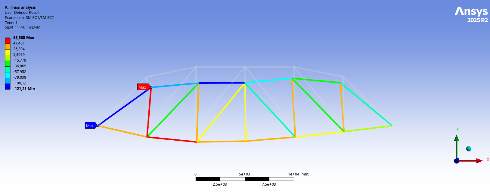
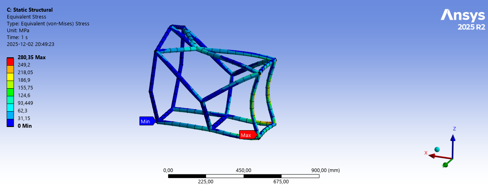
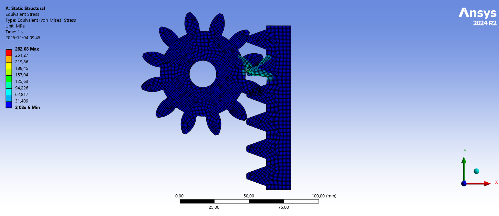
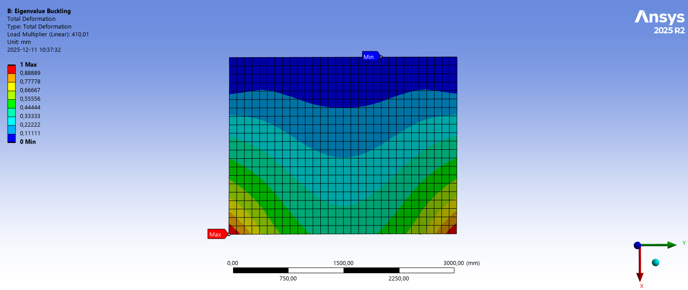

# Finite Element Simulation in Design – Structural, Contact, Buckling, Modal and Thermal FEA in Ansys

**Course:** MMS050 Finite Element Simulation in Design, Chalmers University of Technology (Fall 2025)
**Author:** Ramkumar Huleppa Munavalli
**Tools:** Ansys Workbench (Mechanical, Static Structural, Eigenvalue Buckling, Modal, Steady-State Thermal, parameter / design-point studies)

---

## Overview
Three hand-in assignments covering the **finite element workflow used in engineering design**: setting up boundary conditions and loads, choosing element types (beam, shell, 2D, solid), meshing strategy and convergence, contact modelling, and checking designs against stress, deflection, mass and factor-of-safety requirements. The assignments go from linear static analysis through **contact and non-linearity** to **buckling, modal and thermo-mechanical** analysis.

| Assignment | Focus | Example problems |
|------------|-------|------------------|
| 1 | Linear static analysis and design | Truss bridges, gear & rack, impeller pump, parameter optimisation |
| 2 | Modelling choices, meshing and contact | Water tower, dam (2D vs 3D), defeaturing, FSAE space frame, gear contact, convergence |
| 3 | Stability, dynamics and multiphysics | Buckling, geometric non-linearity, modal analysis, thermo-mechanical slab |

📄 Reports: [Assignment 1](Assignment-1/MMS050_Assignment_1.pdf) · [Assignment 2](Assignment-2/MMS050_Assignment_2.pdf) · [Assignment 3](Assignment-3/MMS050_Assignment_3.pdf)

---

## Assignment 1 – Linear Static Analysis and Design

### Task 1 – 2D truss bridge
- Designed a truss bridge with **hollow tube members** (Ø72/Ø50 mm) and analysed deformation and normal force/stress for two truss angles.
- At 15° the peak compressive stress is **121 MPa (FoS 2.0)**. At 50° it is **126 MPa (FoS 1.99)**.

### Task 2 – Yandhai Nepean crossing (pedestrian bridge)
- Found the crowd load the bridge can carry: about **13 250 people** at 80 kg each.
- Applied a vehicle load (2.5 m wheelbase) across two nodes and found the maximum vehicle load that keeps **deflection below 100 mm and stress below 100 MPa**.

### Task 3 – Gear and rack
- Static analysis of a gear–rack pair: deformation and von Mises stress, and a reaction-force check (2500 N applied, 2492 N recovered).
- Refined the mesh to 1 mm and sized the tooth thickness to **13 mm for FoS ≈ 2.0**.

### Task 4 – Impeller pump
- Analysed the impeller (structural steel), the housing (polyethylene) and the full assembly.
- **Factor of safety on stress and on deformation:** the impeller is 25.1 on stress and 3.6 on deformation, and the housing is 10 and 4.1. So **deformation governs the design**.
- Discussed **averaged vs unaveraged stress contours**, and why unaveraged results should be used to find true local peaks.

### Task 5 – Parameter management (design optimisation)
- Ran a **design-point study** on a bracket, with bracket and gusset thickness as parameters.
- **Recommended design:** 2.5 mm bracket and 1.5 mm gusset. That gives a stress of **11.2 MPa (< 12 MPa)** and a mass of **0.088 kg (< 0.10 kg)**. I also produced a response surface of von Mises stress.



---

## Assignment 2 – Modelling Choices, Meshing and Contact

### Task 1 – Water tower (beam and shell model)
- Modelled a steel frame tower (beam elements) with a shell water tank under water weight and internal pressure.
- Reached **FoS 2.99** (critical at the tank–tower joint) with **56.8 mm deflection** (limit 200 mm). The frame mass is **27.1 t**, using tubes of 95/50 mm outer/inner radius.

### Task 2 – Dam structure (2D vs 3D)
- Compared a **2D plane model** with a **3D solid model** using a section plane. Both give the same principal stresses: maximum about 2.8 MPa, minimum about 3.8 MPa.

### Task 3 – Meshing and defeaturing
- Compared a uniform 3 mm mesh with a **coarse mesh plus local refinement**, with and without **defeaturing**. Refinement gave almost the same peak stress (about 45 MPa) with **80 % fewer nodes**. Defeaturing cut the model size further and still captured the trends.

### Task 4 – Bracket mesh sensitivity
- Studied how mesh size (10, 50 and 100 mm) affects the **location and size of peak stress**, with and without defeaturing, and set up a mesh refined only at the fillet.

### Task 5 – Space frame (Formula Student style chassis)
- Analysed an aluminium tube frame under a **30 kN impact load** with the front hoop fixed. I then proposed two lighter designs:

| Design | Tube sections | Deformation | Max stress | Mass |
|--------|---------------|-------------|------------|------|
| Baseline | Ø25.4/20.57 mm | 5.20 mm | 287 MPa | 4.10 kg |
| Proposal 1 | Ø28/24 mm | 4.53 mm | 270 MPa | 3.84 kg |
| Proposal 2 | Mixed sections by member | 5.00 mm | 280 MPa | **3.74 kg** |

### Task 6 – Gear and rack revisited (non-linear contact)
- Set up **frictional contact** and tracked contact status (far → near → sliding) as the gear rotates into the rack.
- Compared **frictionless contact**, **pressure contact** and the **Normal Lagrange formulation**. Correct contact modelling gives about **283 MPa (FoS 0.88)**, which shows the simple linear model from Assignment 1 **under-predicted the stress**.
- Studied **force convergence**: 2 iterations without friction and 3 with µ = 0.2.

### Task 7 – Convergence and divergence
- Did manual **mesh convergence studies** (peak stress against element size, and % change) for a **round hole** and a **square hole**. I also repeated the square-hole study with **non-linear structural steel**, and discussed how sharp corners affect stress convergence.

| Space frame – max stress | Gear & rack contact stress |
|---|---|
|  |  |

---

## Assignment 3 – Stability, Dynamics and Multiphysics

### Task 1 – Buckling of the water tower
- Ran an **eigenvalue buckling** analysis of the tower frame. With Ø120/80 mm tubes the lowest load factor was 0.38, so it would buckle. Increasing to **Ø160/120 mm** raised the **load factor to 1.03** and the FoS to about 3.1.

### Task 2 – Buckling of a stiffened panel
- Found the **critical loads for the three lowest buckling modes**: 205, 211 and 392 kN.
- Repeated the analysis with a prescribed displacement instead of a force, and with **10 kPa lateral pressure**. The lateral pressure gave negative load multipliers, meaning buckling would only happen under tension.

### Task 3 – Geometric non-linearity
- Compared **linear and geometrically non-linear** analysis of a cantilever beam under a 10 kNm end moment. The large-deflection analysis updates the stiffness and gives a smaller transverse deflection and some axial shortening.

### Task 4 – Modal analysis
- Found the natural frequencies and mode shapes, with the first two modes around **1.96 kHz**, and ran a **design-point study** on the lowest eigenfrequency.

### Task 5 – Thermo-mechanical analysis of a concrete slab (floor heating)
- **Steady-state thermal analysis** of a slab heated by embedded water pipes. With 41.8 °C water, the top surface reaches **31.4 °C**.
- Mapped the temperature field into a **structural analysis**. The maximum principal stress is **2.17 MPa** (below 3 MPa tensile strength) and the compressive stress is **18 MPa** (below 30 MPa), so the slab is safe.



---

## Repository Structure
```
Finite-Element-Simulation-in-Design/
├── README.md
├── images/                 Key result plots from the reports
├── Assignment-1/           MMS050_Assignment_1.pdf
├── Assignment-2/           MMS050_Assignment_2.pdf
└── Assignment-3/           MMS050_Assignment_3.pdf
```

## Key Skills
`Ansys Workbench / Mechanical` · `Linear static FEA` · `Beam, shell, 2D & solid elements` · `Meshing strategy & mesh convergence` · `Defeaturing` · `Contact modelling (frictional, frictionless, Normal Lagrange)` · `Non-linear analysis` · `Eigenvalue buckling` · `Modal analysis` · `Thermo-mechanical coupling` · `Parametric design / optimisation` · `Factor of safety assessment` · `Lightweight structural design`
