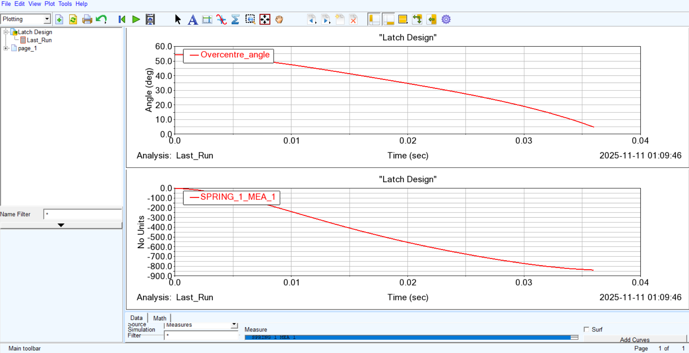
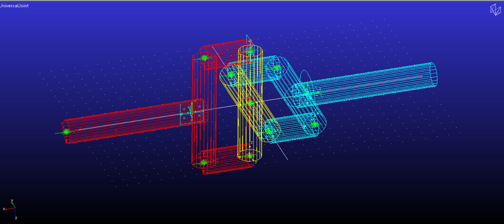
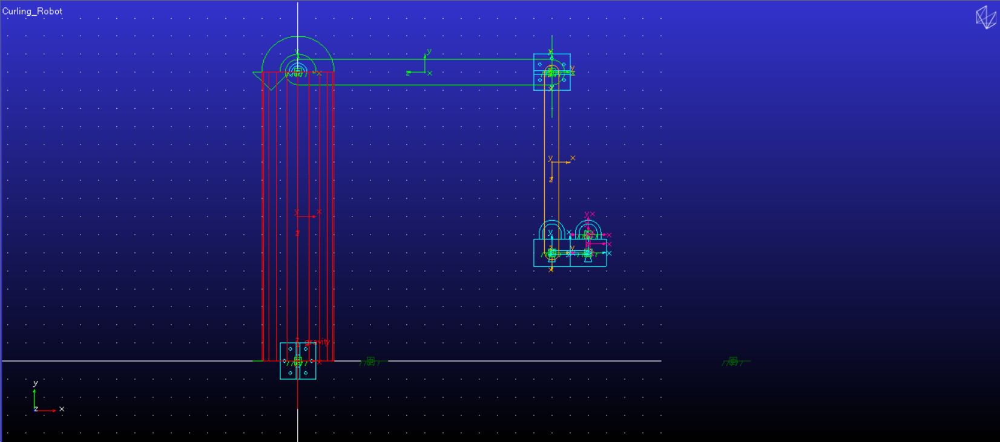
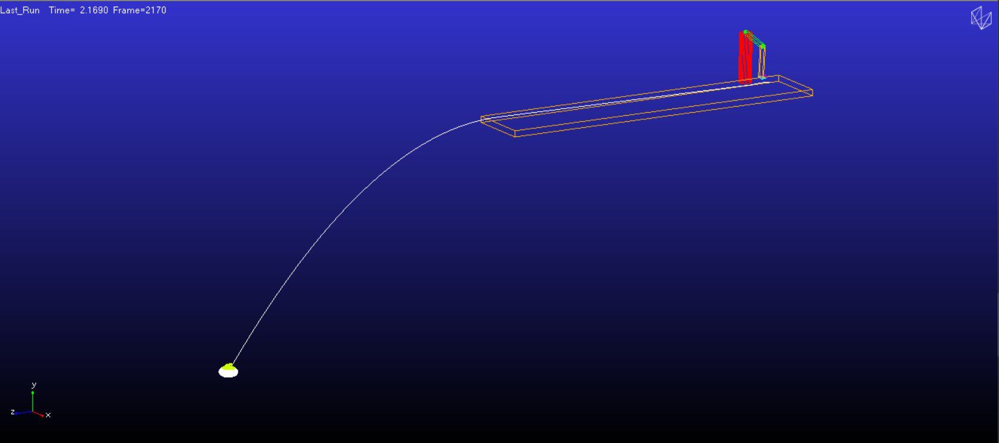
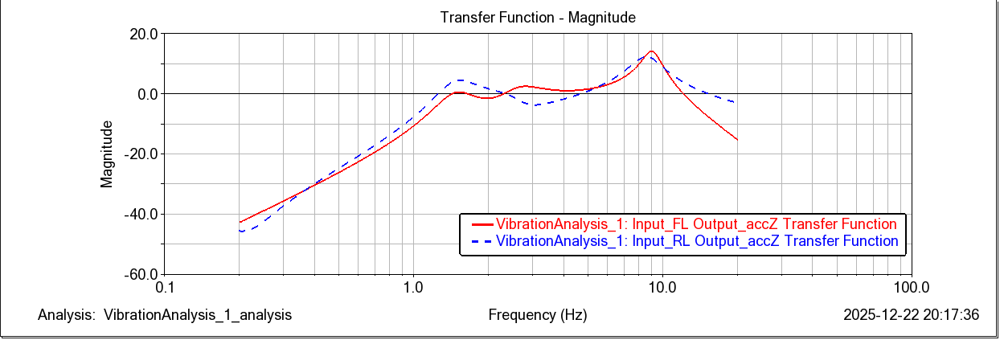

# Rigid Body Dynamics – Analytical Mechanics and Multibody Simulation in Adams

**Course:** MMA093 Rigid Body Dynamics, Chalmers University of Technology (Fall 2025)
**Author:** Ramkumar Huleppa Munavalli
**Tools:** MSC Adams View (multibody dynamics), analytical derivations (Newton–Euler, Lagrange)

---

## Overview
In this course, every problem was solved twice: **analytically by hand** (kinematics, Newton–Euler and Lagrangian mechanics, constraints, momentum and energy) and then **numerically in MSC Adams** with a multibody model. The Adams results were used to **verify the hand derivations**. The assignments build from simple contact problems to a 3D robot and a full off-road vehicle with vibration analysis.

| # | Topic | Adams model |
|---|-------|-------------|
| 1 | Latch design and box sliding on a moving wedge | Latch, box–wedge |
| 2 | Cylinder with horizontal bar: Lagrange equations and energy | Cylinder–bar with contact |
| 3 | Universal (Hooke's) joint kinematics | Custom UJ and built-in hook joint |
| 4 | 3D robot kinematics and a curling-stone throw | Curling robot |
| 5 | All-terrain vehicle: vibration modes and a non-linear damper | Terrain vehicle |

Each assignment has a **mandatory part** and, in most cases, a **supplementary part**. The folder for each assignment holds its report and Adams command files (`.cmd`).

---

## Assignment 1 – Latch Design and Box on a Wedge
**Part 1: Latch design**
- Built an over-centre **latch mechanism** in Adams, with a spring-force measure for the clamping force and an angle measure to check that the handle goes far enough to lock.
- Added a **sensor** that stops the simulation at the over-centre position, and tracked spring force and angle with strip charts.

**Part 2: Box sliding on a wedge**
- Derived the velocities of the box and wedge analytically, the friction coefficient needed to keep the wedge at rest, the **constraint equation**, and the system's **linear momentum**.
- Verified everything in Adams:

| Quantity | Analytical | Adams |
|----------|-----------|-------|
| Box velocity | 2.942 m/s | ✓ matches |
| Wedge velocity | −0.483 m/s | ✓ matches |
| Relative velocity | 3.348 m/s | ✓ matches |

- Studied friction effects: with box–wedge friction µ₁ = 0.44, the box leaves at 1.47 m/s. With ground friction µ₂ = 0.0753, the wedge stays at rest (velocity ≈ 0).
- Checked horizontal and vertical momentum for four friction cases, and solved problem 1.13 from the Boström compendium.



## Assignment 2 – Cylinder with Horizontal Bar
**Mandatory**
- Derived the **equations of motion** for a rolling cylinder with an attached bar, using **Lagrange's equations**, and identified the cyclic coordinate.
- Derived the bar's angular velocity analytically: **9.70 rad/s**, against **9.69 rad/s** in Adams. I modelled no-slip rolling with a contact friction coefficient of 1 and very small stiction velocities.

**Supplementary**
- **Energy analysis** in Adams (cylinder kinetic energy, bar kinetic and potential energy, total mechanical energy) for three friction cases:
  - **µ = 0:** mechanical energy is conserved (−3.998 J in Adams vs −3.986 J analytically).
  - **µ = 0.02:** no significant slip, so energy is unchanged.
  - **µ = 1.0:** slip occurs and mechanical energy drops (to −4.018 J).
- Solved problem 5.6 from the Boström compendium.

## Assignment 3 – Universal (Hooke's) Joint
**Mandatory**
- Derived the input–output kinematics of a **universal joint**, where the output speed fluctuates with the shaft angle β.
- Built the joint in Adams **from three rigid bodies** (input shaft, cross and output shaft), and again with Adams' **built-in hooke joint**. Both models give the same result.
- Compared the simulated **speed ratio** with the analytical relation:

| Shaft angle β | Speed ratio range (ω<sub>out</sub>/ω<sub>in</sub>) |
|---------------|----------------------------------------|
| 0° | 1.0 (constant) |
| 10° | 0.984 – 1.015 |
| 30° | 0.866 – 1.154 |

This matches the theory: cos β ≤ ω<sub>out</sub>/ω<sub>in</sub> ≤ 1/cos β.

**Supplementary**
- Hand derivation of the analytical speed-ratio relation.



## Assignment 4 – 3D Robot Kinematics and Curling
**Mandatory**
- Derived the **rotation matrix**, the **angular velocity vector**, and the **velocity and acceleration of an end point P** for a multi-joint robot arm.
- Modelled the robot in Adams and verified the derivations:

| | ω<sub>x</sub>, ω<sub>y</sub>, ω<sub>z</sub> (rad/s) | v<sub>P</sub> (m/s) | a<sub>P</sub> (m/s²) |
|---|---|---|---|
| Analytical | 0.314, 0.157, −0.785 | 0.126, −0.605, −0.071 | −0.289, 0, −0.321 |
| Adams | 0.314, 0.157, −0.785 | 0.126, −0.604, −0.071 | −0.286, 0.007, −0.326 |

- Programmed a **control sequence** so the robot lifts and **throws a curling stone** along an ice strip, then plotted the stone's position and centre-of-mass trajectory.

**Supplementary – curling game**
- Tuned the throw so the yellow stone hits a red stone at target point E. After the collision the yellow stone ends up about **3.0 m** from E.

| Robot model | Curling stone trajectory |
|---|---|
|  |  |

## Assignment 5 – All-Terrain Vehicle: Vibration and Damper Analysis
**A. Time and frequency domain analysis**
- Simulated an **ATV over a road profile** for 100 s and found the **vertical acceleration at the driver's seat**.
- **FFT** of the seat acceleration shows two resonances, at **1.42 Hz** and **8.14 Hz**.
- **Eigenmode analysis** of the linearised model matched them to mode 62 at 1.47 Hz (**heave and pitch**) and mode 65 at 8.61 Hz (**wheel hop**).
- **Forced vibration analysis:** transfer functions from the front-left and rear-left wheel inputs to seat acceleration show peaks at **1.49 Hz** and **8.57 Hz**.
- **Parameter studies:**
  - **Less damping:** the heave, pitch and wheel-hop modes separate into peaks at 1.52, 2.76 and 8.89 Hz.
  - **Stiffer springs:** the body mode moves up to 1.81 Hz.
- Compared the **pros and cons of time-domain and frequency-domain analysis** for ride comfort, including linking them to the human sensitivity range of 4–8 Hz.

**B. Rear damper analysis**
- Compared a **linear rear damper** with a **non-linear damper** defined from measured data points with **splines**. I looked at rear damper force and swing-arm angle on the normal road and on a road with a **bump**.
- The non-linear damper gives **sharper, more irregular force peaks** and **larger swing-arm oscillations** after the disturbance.
- Solved problems 2.6 and 6.5 from the Boström compendium.



---

## Repository Structure
```
Rigid-Body-Dynamics/
├── README.md
├── images/                           Key figures from the reports
├── Assignment-1/                     Latch & box-on-wedge (report + 2 Adams models)
├── Assignment-2/
│   ├── Mandatory/                    Cylinder–bar model + report
│   └── Supplementary/                Energy analysis model + report
├── Assignment-3/
│   ├── Mandatory/                    Universal joint (custom & built-in) models + report
│   └── Supplementary/                Analytical derivation report
├── Assignment-4/
│   ├── Mandatory/                    Curling robot model + report
│   └── Supplementary/                Curling game model + report
└── Assignment-5/                     ATV vibration & damper model + report
```

## How to Open the Adams Models
The models are saved as **Adams View command files (`.cmd`)**. In **MSC Adams View**, go to **File → Import**, choose *Adams View Command File (\*.cmd)* and select the file. The model is rebuilt, and you can run the simulations and plots from there.

## Key Skills
`Rigid body kinematics & kinetics` · `Newton–Euler equations` · `Lagrangian mechanics` · `Constraints & generalised coordinates` · `Momentum & energy methods` · `3D rotation matrices` · `MSC Adams` · `Multibody dynamics simulation` · `Contact & friction modelling` · `Mechanism design (latch, universal joint)` · `Vehicle vibration / eigenmode analysis` · `FFT & transfer functions` · `Non-linear damper modelling`
